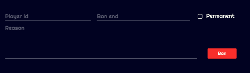
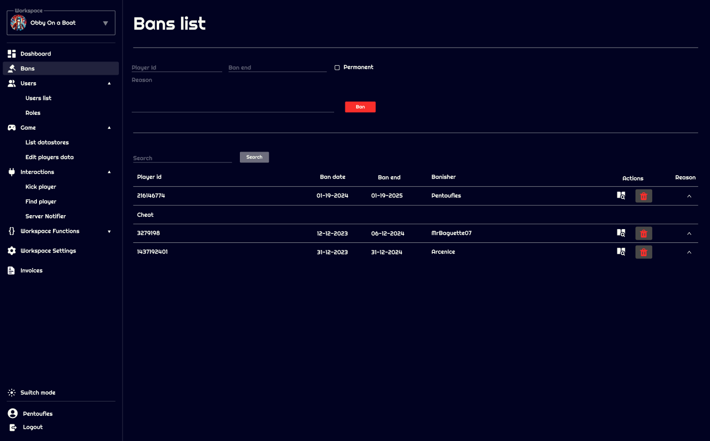

# Bans

Ban management is essential for maintaining a healthy community by enabling administrators to temporarily or permanently restrict players who violate community rules.

## Ban Form

To ban a player, complete the ban form with the necessary information:

- **Player ID**: The unique identifier of the player to be banned.
- **Ban End**: The end date of the ban. Leave blank for a permanent ban.
- **Permanent**: Check this box if the ban is meant to be permanent.
- **Reason**: The reason for the ban. Be specific for future reference.

Confirm the ban once the form is completed to enforce it.

## Ban List

The ban list displays currently banned players with the following details:

- **Player ID**
- **Ban Date**: The date the ban was enforced.
- **Ban End**: The end date of the ban, if applicable.
- **Banisher**: The user who enacted the ban.
- **Actions**: Includes an icon to view the player's ban history and an icon to unban the player.

Each row in the list can be expanded to display the reason for the ban.

### Viewing Ban History

Click on the history icon to access a player's complete ban history, providing context and understanding of past actions.

### Unbanning a Player

To lift a ban, use the unban icon next to the concerned player. Confirm the action to immediately restore the player's access.

## Best Practices

- **Accuracy**: Ensure the reason for the ban is clear and precise for future reference.
- **Consistency**: Apply bans consistently to maintain fairness within the community.
- **Review**: Periodically reconsider permanent bans to see if reinstatement is possible.

Effective ban management is crucial for keeping a community healthy and engaging. Use these tools with consideration and in the best interest of your gaming space.
