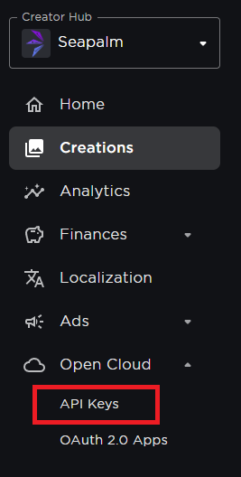
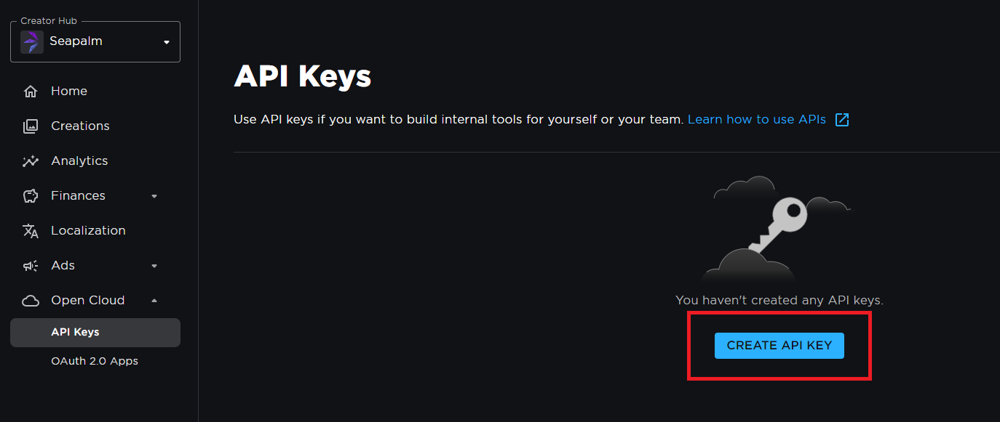
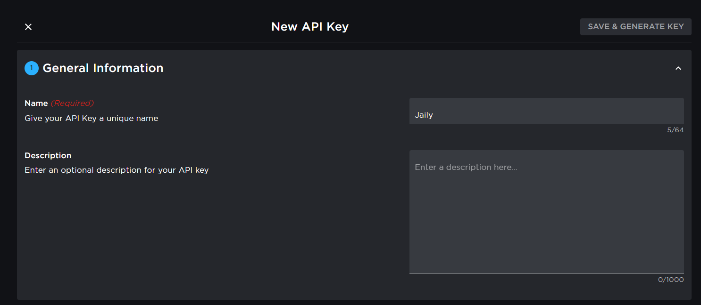
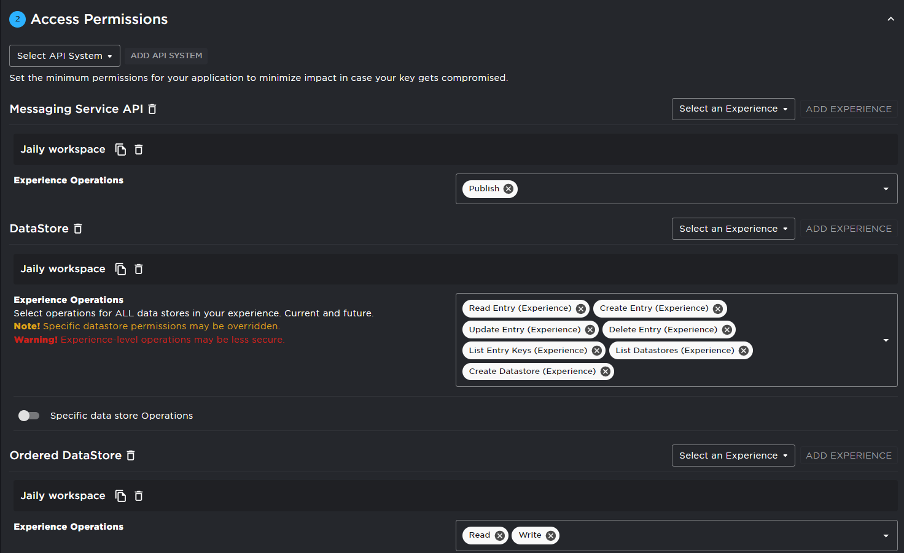
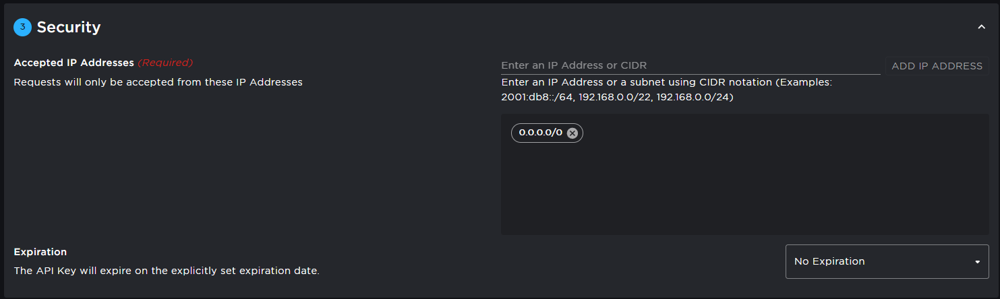
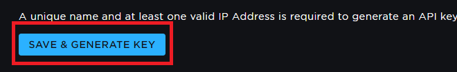
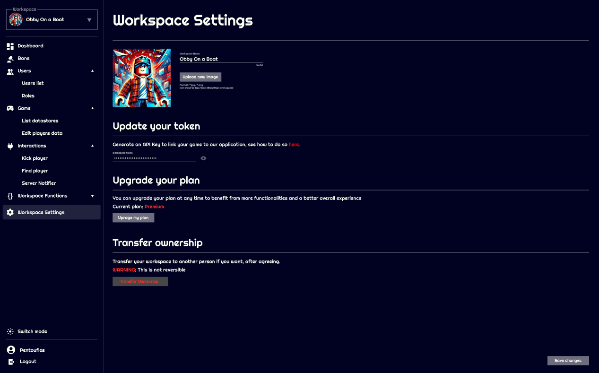
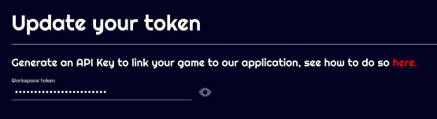
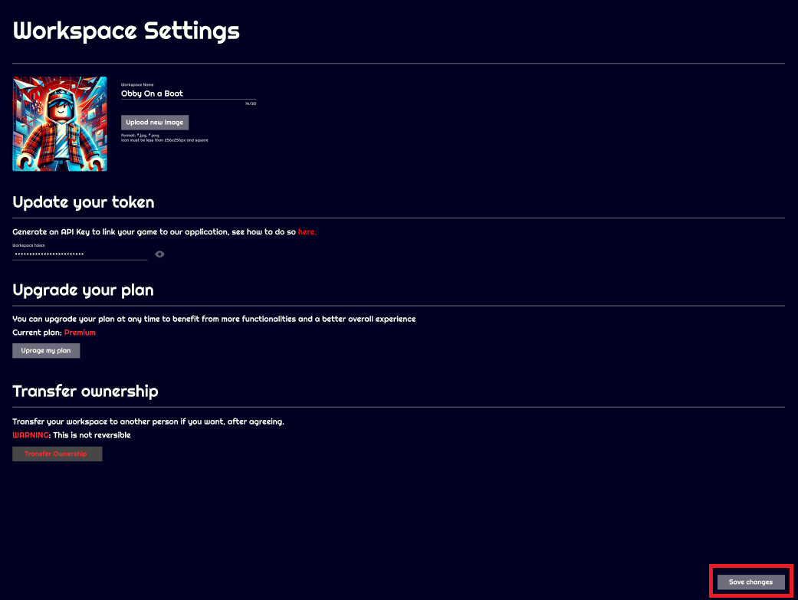

# Installation

## Generate API key

First, go to Roblox creator dashboard, select the workspace where your experience is, then click on `Open cloud` > `API Keys`

Once you clicked `API Keys`, click `CREATE API KEY`

Then, fill infos like this:

You must make sure you give access to the 3 following type of APIs:

- Datastore
- OrderedDatastore
- Messaging service

They are necessary for Jaily to work.  
Make sure to also give access to the operations listed above.

Finally, in the security tab you must give access to all sources so that we, at Jaily, can access your game from our servers.
To do so, you must allow ip **0.0.0.0/0**  

And set expiration to whatever you want, best is no expiration so you don't have to re-enter your token every period of time on Jaily.

Then you can hit **Save & generate key**

And copy your newly generated key !

<b>WARNING</b> You won't be able to see this key after, so store it carefully

## Link Jaily to your experience

To link Jaily to your experience, it's really easy. After generating your token with the method above, you can input it on Jaily in your workspace settings:

In the **Update your token** category, you can put the token you generated previously

Then hit **Save changes**

**BOOM** You're done, Jaily is now linked to your game !