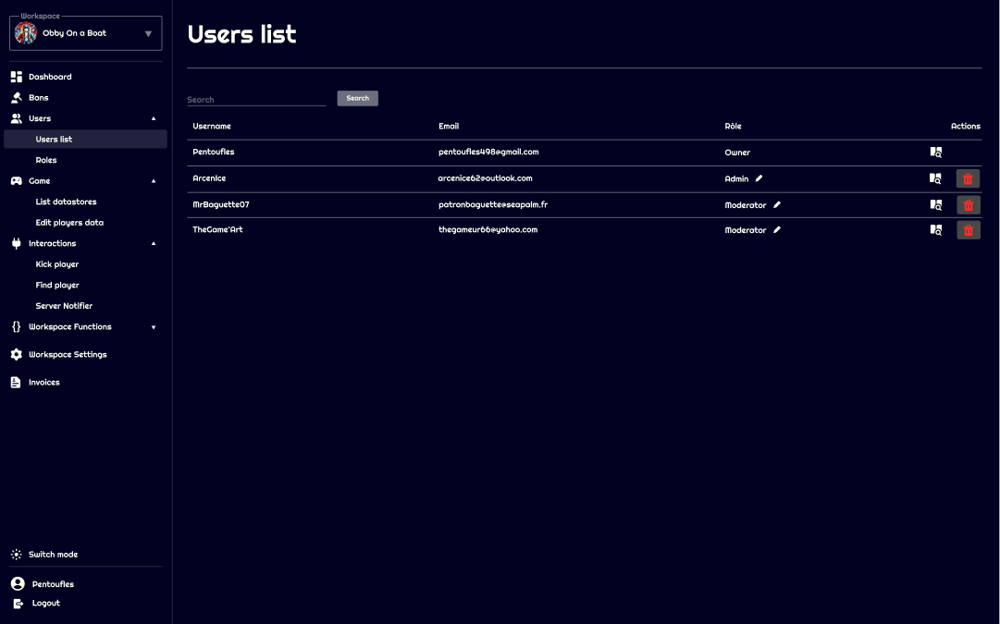

# Users

On Jaily, you can invite your staff in your workspace. It allows you to give them permissions to ban players, or even more if you wish.

## Users list

## Searching for users

Here you can search for users invited in your workspace, you can search either by username or by email.

## Remove user from workspace

You can remove someone from your workspace by clicking the bin icon at the end of his line in the table.

## Check user historic

Checking user historic allows you to see every action that he's done since he is member of your workspace.  
This way you can detect easily abuses or even check easily the activity of your staff.

## Changing user role

Changing the role of a member is really easy, after creating the rank in the dedicated page, you can click on the edit button located in **Role** category.

