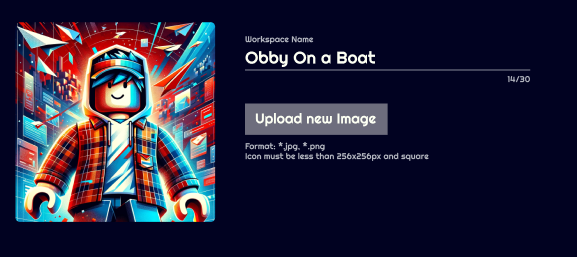
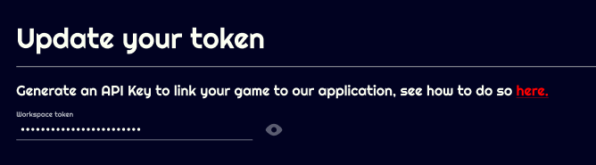
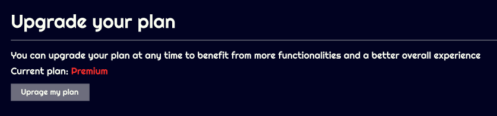
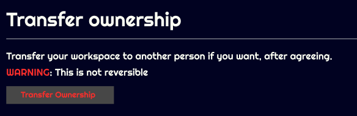

# Workspaces

## What's a workspace ?

A workspace is a space on Jaily that is linked to your game. 
 
A user can have access to your workspace but also to multiple others, each workspace has its own custom ranks, functions, etc.

## Workspace name

The name displayed for your workspace.  
You can change it here: 

## Workspace icon

To change workspace icon, you can click "Upload new image"
The requirements for your new icon is:  

- 256px X 256px MAX  
- Format: JPG or JPEG or PNG
- Max size: 1MB

## Experience token

Token is a key used to link Jaily with your experience, you can edit it in workspace settings

## Upgrade plan

You can only upgrade it to a higher plan and not downgrade it.

## Transfer ownership

You can transfer the ownership of your workspace,  
This will cancel subscription and the new owner will have to input his payment informations.  
The new payment will take place at the expiration date of previous subscription.

